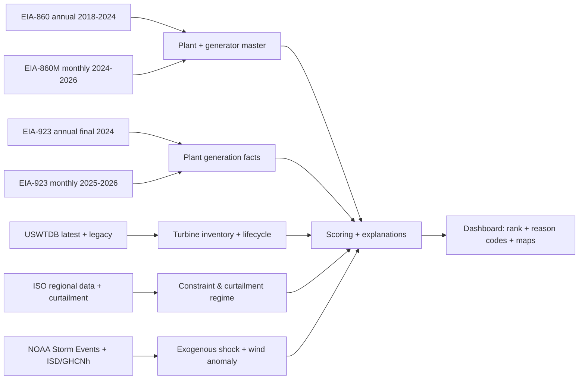

# High-value 2024–2026 datasets for your wind distressed-asset dashboard

## Executive summary

Your current markdown pipeline is a strong “fundamentals screener”: it merges **plant + generator metadata (EIA‑860)** with **historical plant generation (EIA‑923)**, maps turbines via **USWTDB**, adds **NERC region from eGRID**, benchmarks against **Berkeley Lab wind market data**, and produces a reproducible scoring/dashboard workflow. fileciteturn1file0

What changes in **2024–2026** is not the core logic—it’s **data timeliness and diagnosis**. Plant-level “truth” still comes from EIA annual and monthly filings, but now you can materially reduce latency and sharpen attribution by adding:

- **EIA‑860M monthly inventory (includes Jan 2026 already)** to track *capacity changes, retirements, repowering signals*, and to prevent false “decline” flags when MW changes are intentional. citeturn7view2  
- **EIA‑923 final 2024 + monthly through Dec 2025** (available now), so your plant-level CF and decline metrics can extend beyond 2023 without waiting for the next annual cycle. citeturn20view4  
- **CAISO daily renewable reports with Jan–Mar 2026 postings** to directly observe curtailment and wind awards in early 2026 (system-level) without press-release parsing. citeturn21view0turn22view0turn23view0  
- **Interconnection-queue pressure (Queued Up 2025 edition; data through end‑2024 + codebook)** to quantify *congestion/upgrade risk* and “future curtailment pressure” near your assets. citeturn20view2  
- **USWTDB quarterly release + legacy versions** to detect turbine removals/additions and lifecycle changes (repowering/decommissioning) with an auditable version history. citeturn5search0turn6view4  
- **NOAA Storm Events bulk CSV (through Dec 2025; file builds updated March 2026)** to tag “true operational underperformance” vs. “weather damage events nearby.” citeturn16search0turn9view4  

The most important practical note as of **Saturday, March 21, 2026** (America/New_York):  
- **EIA‑860 final 2024 is released (Sep 9, 2025).** Next early release 2025 is expected June 2026. citeturn20view3  
- **EIA‑923 annual final 2024 is released (Sep 18, 2025).** Monthly data are available through **Dec 2025** (released Feb 24, 2026); **Jan 2026** is expected end of March 2026. citeturn20view4  
- **EIA‑860M has Jan 2026 XLS available now** (release page shows Feb 24, 2026 release and a Jan 2026 download). citeturn7view2  
So you can already build a dashboard that is “2024 complete, 2025 mostly complete (monthly), and 2026 partially live (system-level + inventory).” citeturn20view4turn7view2turn22view0  

## What your markdown already gets right and what it misses for 2024–2026

Your markdown defines a reproducible pipeline and dashboard around five sources: **EIA‑860 (2018–2023)**, **EIA‑923 (2018–2023)**, **USWTDB**, **eGRID (NERC only)**, and **Berkeley Lab wind market report Excel**. fileciteturn1file0

That design is correct for two reasons:

First, it anchors everything to **EIA plant codes** and consistent annual reporting, which makes joins and audit trails straightforward. fileciteturn1file0

Second, it explicitly avoids low-grade “narrative” sources and instead uses structured datasets with known provenance, while still allowing a modular extension path. fileciteturn1file0

The 2024–2026 gaps are mostly about **timeliness** and **diagnosis**:

- **Timeliness gap:** restricting EIA‑860/923 to 2018–2023 is now leaving a full year of final data (2024) and a year of monthly partials (2025) on the table. EIA has published final 2024 releases for both EIA‑860 and EIA‑923 in September 2025. citeturn20view3turn20view4  
- **Diagnosis gap:** your current features can flag underperformance, but they can’t reliably separate:
  - true O&M / turbine issues  
  - capacity-change artifacts (retirements, partial repower)  
  - congestion/curtailment (system-driven)  
  - exogenous shocks (storms)  
Adding 860M + ISO/curtailment + storm weather events materially improves that separation without resorting to “press release slop.” citeturn7view2turn9view3turn16search0  

image_group{"layout":"carousel","aspect_ratio":"16:9","query":["EIA Hourly Electric Grid Monitor EIA-930 screenshot","EIA Form 860M preliminary monthly electric generator inventory page","US Wind Turbine Database USWTDB map viewer","CAISO Daily Renewable Report curtailment page"]}

## Highest-value additive datasets and sources for your dashboard

This section prioritizes datasets that are (a) **public**, (b) **structured/time-stamped**, (c) **directly additive** to your existing EIA/USWTDB core, and (d) demonstrably useful for 2024–2026 monitoring and attribution.

### EIA‑860 final 2024 and early 2025 staging

Even though EIA‑860 is already in your markdown, the “high-value dataset” here is specifically the **newer vintages and a workflow change**: keep a rolling 6–8 year window, but always include the most recent *final* year available.

EIA’s EIA‑860 page states **Final 2024 data released September 9, 2025**, and indicates an **early release 2025 data** cycle next (June 2026). citeturn20view3  
Because EIA‑860 also includes a file taxonomy (Plant, Generator, Wind, Owner, etc.), you can expand beyond your current “Plant + Wind” extraction to incorporate **ownership (Schedule 4)** and explicit proposed/retired generator statuses when needed (without inflating file volume too much). citeturn20view3  

**Dashboard features unlocked**
- Ownership complexity (shared ownership) and “operator vs beneficial owner” flags from the Owner file. citeturn20view3  
- More robust de-rate / retirement detection (to avoid false production-decline hits). citeturn20view3  

### EIA‑923 final 2024 and monthly 2025 (and soon monthly 2026)

EIA‑923 is your definitive plant generation source, but for 2024–2026 you should treat it as two streams:

- **Annual final data:** EIA reports **Final 2024 data released September 18, 2025**. citeturn20view4  
- **Monthly “M” releases:** EIA reports a **Feb 24, 2026 monthly release for Dec 2025 data**, and the next monthly release at the **end of March 2026 for Jan 2026 data**. citeturn20view4  

That means your dashboard can already include:
- plant-level 2024 CF and decline vs peak  
- plant-level 2025 year-to-date (through Dec 2025) CF tracking  
- 2026 plant-level monthly tracking beginning once the end-of-March release arrives (and continuing monthly thereafter)

**Dashboard features unlocked**
- “Late-year collapse” detection in 2025 (a common distress signature) without waiting for annual. citeturn20view4  
- Cleaner backtesting: you can time-slice analyses by “data availability date” (which is crucial if you’re evaluating sourcing performance). citeturn20view4  

### EIA‑860M monthly inventory (your best 2024–early 2026 enhancement)

The **Preliminary Monthly Electric Generator Inventory (EIA‑860M)** is purpose-built for “current status of existing and proposed generating units,” and is explicit about being **preliminary estimates** that may be corrected later. citeturn7view2  

Critically for your date constraint, the EIA‑860M page shows:
- **Release Date: February 24, 2026**  
- A downloadable **January 2026** XLS  
- Complete monthly XLS files for all months in **2024** and **2025** citeturn7view2  

This is *not* “press release slop”—it is the official monthly inventory maintained by the same agency that publishes your baseline 860 annual file.

**What it gives you that annual 860 doesn’t**
- A comprehensive retired generator list since 2002 is in the 860M “Retired” tab (EIA notes this explicitly). citeturn7view2turn20view3  
- Month-by-month updates that let you identify capacity changes *before the next annual final 860*. citeturn7view2  

**Dashboard features unlocked**
- “Decline explained by MW change” vs “decline unexplained” (your current markdown calls this out as critical). fileciteturn1file0  
- Repowering / retirement early-warning: sudden changes in unit status, in-service dates, or reported nameplate. citeturn7view2  

### EIA‑930 and its reference tables for BA/ISO mapping

You already identified EIA‑930 as crucial. The “extra” high-value component is: **use the reference tables and respondent mappings** to tighten joins and avoid brittle heuristic mappings.

EIA’s Open Data browser describes the EIA‑930 product as hourly demand/forecast/net generation and interchange by balancing authority (rto routes) and explicitly ties it to “Hourly Electric Grid Monitor.” citeturn0search8turn0search12  
EIA’s API docs also note that as of a January 2024 update, data values were standardized to strings (a real ingestion gotcha if you’re doing numeric parsing). citeturn0search4  
The Open Data browser provides complete example URLs for `electricity/rto/fuel-type-data/data/` queries (including `frequency=hourly` and `facets[respondent][]=` patterns). citeturn17search15  

Separately, EIA’s EIA‑930 Reference Tables exist as an XLSX resource that includes balancing authority groupings and operational metadata. citeturn10search0turn10search1  

**Dashboard features unlocked**
- A “regional wind backdrop” panel (BA/ISO-level wind generation vs your plant CF) for 2024–early 2026 monitoring. citeturn0search8turn0search12  
- Cleaner plant→BA linking (typically via BA codes in EIA 860 plant records plus EIA 930 reference tables). citeturn10search0turn20view3  

### CAISO daily renewable reports (Jan–Mar 2026 data available now)

For “first few months of 2026” you asked for, the standout structured source is **CAISO daily renewable reports**.

CAISO’s library lists Daily Renewable Reports for **Jan 2026 (31 documents)** and also provides buckets for **Feb 2026 and Mar 2026**, indicating continuing publication into 2026. citeturn21view0turn22view0  
A specific daily report page (Jan 31, 2026) shows it includes both **Market Performance** and **Curtailment** sections, including hourly VER curtailment energy and maximum curtailment in MW (system-level). citeturn23view0  

CAISO also states that as of **June 1, 2025** it stopped generating the older “daily wind and solar real-time dispatch curtailment reports” and points users to daily renewable reports instead—so your ingestion logic should switch over at that date. citeturn9view3turn21view0  

**Dashboard features unlocked**
- CAISO/WEIM system-level wind awards and curtailment trends into early 2026 (useful for “region declining vs plant declining” logic). citeturn23view0  
- A clean time-series for curtailment intensity without depending on settlement-grade nodal extracts. citeturn23view0  

### SPP Variable Energy Resource curtailments (multi-year including 2026)

The **Southwest Power Pool** publishes a VER curtailments page with year navigation including **2024, 2025, and 2026**, suggesting direct public access to curtailment history and current-year data. citeturn12search1  
Because I hit timeouts when loading the page in this environment, treat this as “verify accessibility from your network,” but it is a high-value target if directly accessible. citeturn12search1  

**Dashboard features unlocked**
- Curtailment regime shifts (2024–2026) in SPP as a confounder for apparent wind decline. citeturn12search1  

### MISO real-time data APIs (JSON-only as of Dec 2025)

For **MISO**, the high-value change is operational: as of **December 12, 2025** the real-time data feeds are **available in JSON only**, URLs changed, and MISO asks users to avoid pulling them more than once per minute (caching limits). citeturn13view1  

This is exactly the kind of detail that turns into brittle ingestion failures if not built into your dashboard refresh logic.

**Dashboard features unlocked**
- Market condition “context panels” for MISO (congestion/constraints proxies, depending on which JSON feeds you pull). citeturn13view1  
- A realistic “semi-live” market overlay for 2026 monitoring with minimal scraping complexity. citeturn13view1  

### ERCOT public data API (structured + explicit throttles)

The **Electric Reliability Council of Texas** public API is attractive because it’s explicitly designed for programmatic access and states concrete “known limits”: **30 requests per minute** (~1 per 2 seconds), plus a limit of **1,000 historic files per download** batch. citeturn9view2  
It also notes that some regions outside the U.S. may be blocked for security, which matters if you ever run this ingestion from cloud regions. citeturn9view2  

**Dashboard features unlocked**
- ERCOT-specific curtailment/outage/price proxies (depending on endpoints/products you select). citeturn9view2  

### PJM Data Miner 2 (useful, but throttled hard for non-members)

PJM’s Data Miner 2 is useful as a market data portal, but the key “engineering constraint” is rate policy: **non-members may not exceed 6 data connections per minute** (members: 600/min). citeturn4search0turn4search16  
In practical terms, you need aggressive caching and batch extraction if you want to use it for a dashboard.

There is also a defined “wind generation” feed in Data Miner 2 (hourly wind generation amounts in PJM). citeturn12search23  

**Dashboard features unlocked**
- PJM hourly wind generation and other market context (with caching and low-frequency refresh). citeturn12search23turn4search0  

### Berkeley Lab interconnection queues dataset (Queued Up, through end‑2024)

The “Queued Up: 2025 Edition” dataset is unusually valuable because it consolidates queue data from **all seven ISOs/RTOs plus 49 non-ISO operators**, covering ~97% of installed capacity, and ships with a **project-level dataset + codebook/data dictionary + summary tabs** through the end of 2024. citeturn20view2  

Even if your primary objective is distressed wind, queues are an empirical measure of:
- local upgrade pressure
- future congestion
- competitive replacement risk (new wind/solar/storage in the same region)

**Dashboard features unlocked**
- “Congestion pressure index” for each plant using nearby queue MW, withdrawal rates, and time-to-COD metrics. citeturn20view2  

### USWTDB latest + legacy versions (2024–2025 relevance)

The **U.S. Wind Turbine Database** has a clear cadence and documented lag: USGS notes that the most recent turbines in the latest release became operational as recently as **Q1 2025** with some from **Q2 2025**, and that releases typically **lag installations by ~one quarter** due to verification and QC. citeturn5search0turn5search6  
The latest release is described as **~75,417 turbines**, and is published as a formally citable data release. citeturn5search0turn5search17  

For “version history,” there is an explicit **legacy versions dataset** (ver 1.0–8.1) with metadata updated **January 21, 2026**, intended for accessing prior releases. citeturn6view4  

**Dashboard features unlocked**
- Repowering / decommissioning detection by diffing versions (turbines removed, turbines added, changes in technical fields). citeturn6view4turn5search0  
- Confidence scoring: assets with “recent imagery verification” and stable turbine inventories vs. assets with frequent revisions.

### NOAA Storm Events bulk dataset (through Dec 2025; refreshed March 2026)

This is the cleanest “exogenous shock” dataset you can add without slipping into narrative scraping.

NOAA’s Storm Events Database states it contains events **January 1950 to December 2025**, and provides bulk CSV downloads. citeturn16search0turn16search3  
The bulk directory listing shows files with build stamps like `c20260316`, indicating NOAA refreshed outputs in mid‑March 2026 (including 2025 files). citeturn9view4  

**Dashboard features unlocked**
- “Severe weather proximity” flags: events within X miles / Y days of a plant’s decline onset window. citeturn16search0turn16search3  
- A model that avoids attributing performance drops to O&M when a plausible storm event occurred nearby.

### NOAA ISD / ISD-lite and transition to GHCNh for 2026+ weather

For weather normalization you identified NOAA ISD; two additions matter for 2024–2026 implementation:

- ISD is “global hourly,” with a standardized fixed-width format and broad station coverage. citeturn2search2turn16search2  
- NOAA offers ISD in the AWS Open Data Registry, which can simplify bulk ingestion in cloud environments. citeturn2search12  

For 2026 and forward-looking pipeline design, NOAA’s **Global Historical Climatology Network-hourly (GHCNh)** is described as a “next generation hourly/synoptic dataset that replaces ISD.” citeturn16search4  
NCEI data-search pages show 2026 query ranges for GHCNh stations, indicating practical availability for early 2026 extraction via the NOAA data-access tooling. citeturn16search8  

**Dashboard features unlocked**
- Robust, auditable “wind anomaly index” by plant based on nearest stations or gridded products. citeturn16search4turn16search8  

### FERC EQR wholesale contract and transaction data (for revenue realism)

If you want to move from “MWh underperformance” to “underperformance that matters financially,” you need contract/transaction context.

The **Federal Energy Regulatory Commission** states the Electric Quarterly Report (EQR) is its reporting mechanism for public utilities to keep rates/charges on file in a convenient form. citeturn8search0  
FERC provides the **full EQR database for download** and also publishes XML/CSV templates and public data structures/values. citeturn8search2turn8search5  

This is not as clean to map to individual plants as ISO nodal pricing, but it is high-signal for:
- counterparty concentration risk
- contract term structures
- regional transaction price distributions

## How these datasets map to dashboard modules

A dashboard that supports deal work needs fewer charts than you think, but each chart must answer “why is this plant distressed?” The datasets above strengthen each diagnostic module.

### Operating performance module

- Plant CF / decline: EIA‑923 annual final 2024 + monthly 2025. citeturn20view4  
- MW change guardrail: EIA‑860 annual + EIA‑860M monthly inventory. citeturn20view3turn7view2  

**Key derived metric**: “decline unexplained by MW change”  
- Use 860/860M to build a time series of `capacity_mw_by_month` and normalize generation accordingly.

### Curtailment and congestion module

- CAISO: daily renewable reports into early 2026. citeturn21view0turn23view0  
- SPP: VER curtailments (multi-year incl. 2026, subject to access verification). citeturn12search1  
- MISO: RT Data API JSON feeds (cache ≤ 1/min). citeturn13view1  
- ERCOT: Public Data API with explicit throttles. citeturn9view2  
- PJM: Data Miner feeds, but extreme throttling for non-members. citeturn4search0  

**Key derived metrics**:
- Curtailment intensity index (region/system): `curtailed_mwh / potential_mwh` (where applicable)  
- Region-vs-plant diagnostic: “plant down, region stable” vs “region down” leveraging EIA‑930 (and ISO sources when available). citeturn0search8turn0search12  

### Asset lifecycle module

- Turbine inventory and specs: USWTDB latest. citeturn5search0turn5search17  
- Lifecycle changes: USWTDB legacy versions diffing. citeturn6view4  

**Key derived metrics**:
- Turbine count change (version delta)  
- “expected CF” proxy by rotor diameter/hub height and vintage bucket (paired with your existing Berkeley Lab benchmarking). fileciteturn1file0  

### Transmission / queue pressure module

- Queued Up interconnection dataset (through end 2024 + codebook). citeturn20view2  

**Key derived metrics**:
- Nearby queued MW within R miles (e.g., 50–100 miles)  
- Queue withdrawal rate (as a proxy for “study pain”)  
- Median time-in-queue in that operator region (proxy for upgrade/constraint friction). citeturn20view2  

### Exogenous shock module (non-narrative)

- NOAA Storm Events bulk CSV to tag plausible damage and operations disruptions. citeturn16search0turn9view4  
- NOAA ISD/GHCNh for wind anomalies (resource adjustment). citeturn2search2turn16search4  

**Key derived metrics**:
- “Storm proximity score” (distance-weighted, event-type-weighted)  
- “Wind anomaly z-score” during decline window vs 5-year local baseline

## Practical ingestion notes and code patterns

### EIA API v2 patterns (EIA‑930 / rto route)

EIA requires an API key in the URL and documents the generic structure `https://api.eia.gov/API_route?api_key=...`. citeturn17search0  
The Open Data browser provides a fully formed example for `fuel-type-data` under the rto route. citeturn17search15

```python
# Example: EIA-930 net generation by energy source (hourly) via EIA API v2
# NOTE: EIA standardizes returned data values as strings in newer versions; cast explicitly.  citeturn0search4

import requests
import pandas as pd

API_KEY = "YOUR_EIA_KEY"

url = "https://api.eia.gov/v2/electricity/rto/fuel-type-data/data/"
params = {
    "api_key": API_KEY,
    "frequency": "hourly",
    "data[0]": "value",
    "facets[respondent][]": ["TEX"],      # example: ERCOT BA
    "facets[fueltype][]": ["WND"],        # example: wind
    "start": "2026-01-01T00",
    "end": "2026-03-01T00",
    "sort[0][column]": "period",
    "sort[0][direction]": "asc",
    "offset": 0,
    "length": 5000
}

r = requests.get(url, params=params, timeout=60)
r.raise_for_status()
data = r.json()

df = pd.DataFrame(data["response"]["data"])
df["value_mw"] = df["value"].astype(float)   # explicit cast (strings) citeturn0search4
```

### ISO/market sources: enforce “polite rate + cache + incremental fetch”

- **ERCOT**: 30 requests/min, 429 on throttle. citeturn9view2  
- **MISO**: avoid hitting feeds more than once per minute (explicit request). citeturn13view1  
- **PJM Data Miner**: non-members limited to 6 connections/min—cache and batch. citeturn4search0  

A universal pattern:

```python
# Pseudocode: shared throttle + caching wrapper
def fetch_json(url, params, cache, key, min_interval_seconds):
    now = time.time()
    if key in cache and now - cache[key]["ts"] < min_interval_seconds:
        return cache[key]["data"]

    while True:
        resp = requests.get(url, params=params, timeout=60)
        if resp.status_code == 429:
            # Use exponential backoff with jitter
            time.sleep(backoff_seconds())
            continue
        resp.raise_for_status()
        data = resp.json()
        cache[key] = {"ts": now, "data": data}
        return data
```

### CAISO daily renewable reports: scrape with “document list → daily page → table extraction”

The CAISO library pages give deterministic daily URLs and posting timestamps (good for incremental crawling). citeturn22view0turn23view0  
Your scraper should:
1) parse the monthly index page  
2) fetch and store each daily HTML report  
3) extract the underlying numeric tables (if present) or any embedded CSV/JSON links (if present)

Given CAISO’s report pages are structured as HTML sections, you’ll likely need:
- BeautifulSoup to find tables  
- a fallback to extract values from embedded scripts if charts are rendered that way

## Recency and suitability table for 2024–early 2026

This table focuses on what you asked for: **2024 and 2025 particularly, plus early 2026**, and “dashboard readiness.”

| Source | Latest “as of Mar 21, 2026” coverage you can count on | Granularity | Notes for dashboard |
|---|---|---|---|
| EIA‑860 | Final **2024** (released Sep 9, 2025) | Annual | Use for authoritative MW and ownership; early 2025 expected June 2026. citeturn20view3 |
| EIA‑860M | Monthly through **Jan 2026** (download shows Jan 2026 file) + full 2024/2025 months | Monthly | Best near-term capacity-change feed; preliminary values may be revised. citeturn7view2 |
| EIA‑923 | Final **2024** + monthly through **Dec 2025** (released Feb 24, 2026); Jan 2026 expected end of Mar 2026 | Monthly + annual | Extends plant CF/decline beyond 2023 without waiting. citeturn20view4 |
| CAISO daily renewable reports | **Jan–Mar 2026** available (daily documents) | Daily / intraday metrics | System-level VER awards + curtailment; scrapeable HTML. citeturn21view0turn22view0turn23view0 |
| USWTDB latest | Latest includes turbines operational into **Q1/Q2 2025** | Turbine-level | Quarterly-ish lag; best turbine specs + lat/lon. citeturn5search0turn5search17 |
| USWTDB legacy versions | Metadata updated **Jan 21, 2026** | Versioned snapshots | Enables diffs for turbine removals/additions. citeturn6view4 |
| NOAA Storm Events | Bulk contains events through **Dec 2025**, refreshed in March 2026 build | Event-level | Non-narrative “damage plausibility” signal; join by time + geodistance. citeturn16search0turn9view4 |
| Queued Up (Berkeley Lab) | Data through **end of 2024** + codebook | Project-level | Best public dataset for “queue pressure” and upgrade-congestion risk. citeturn20view2 |
| eGRID | Latest official described as eGRID2023 (2023 data; released Jan 2025); eGRID2024 planned Jan 2026 but not shown as released | Annual | You only use NERC region; stable enough. citeturn15search0turn14search0 |

### Suggested mermaid: your “2024–2026 nowcasting” pipeline



## Bottom line: the “more high value datasets” shortlist

If you only add a few things (and you want them to be non-sloppy, structured, and 2024–early 2026 relevant), prioritize:

- **EIA‑860M (monthly) + extend EIA‑860/EIA‑923 to final 2024 and monthly 2025** for the core plant truth and capacity-change guardrails. citeturn7view2turn20view3turn20view4  
- **CAISO daily renewable reports** for early‑2026 curtailment and wind awards in CAISO/WEIM. citeturn21view0turn23view0  
- **Queued Up (interconnection queues through end‑2024 + codebook)** to quantify congestion/upgrade/competition pressure (the most underused “deal edge” dataset that is still clean and public). citeturn20view2  
- **USWTDB legacy diffs** to capture real asset lifecycle movement (repowering/decommissioning) without relying on narrative. citeturn6view4turn5search0  
- **NOAA Storm Events bulk CSV** as a defensible “exogenous shock / damage plausibility” tagger that helps prevent false O&M conclusions. citeturn16search0turn9view4